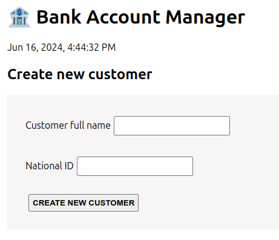
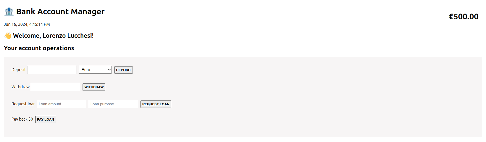

# Bank Account Manager

Bank Account Manager is a web application that allows you to manage your bank account by performing various operations such as deposits, withdrawals, loan requests, and creating new customers. This project uses React and Redux Toolkit.

## Features

- **Create Customer**: Add a customer by entering their full name and national ID.
- **Customer Welcome**: Display a welcome message for the current customer.
- **Deposit**: Deposit an amount in different currencies (EUR, USD, GBP) and automatically convert to EUR.
- **Withdraw**: Withdraw an amount from your account balance.
- **Request Loan**: Request a loan by specifying an amount and purpose.
- **Pay Loan**: Repay the current loan.

## Screenshots





## Installation

1. Clone the repository:

   ```bash
   git clone https://github.com/lucchesilorenzo/bank-account-manager.git
   cd bank-account-manager
   ```

2. Install dependencies:

   ```bash
   npm install
   ```

3. Start the development server:
   ```bash
   npm start
   ```
